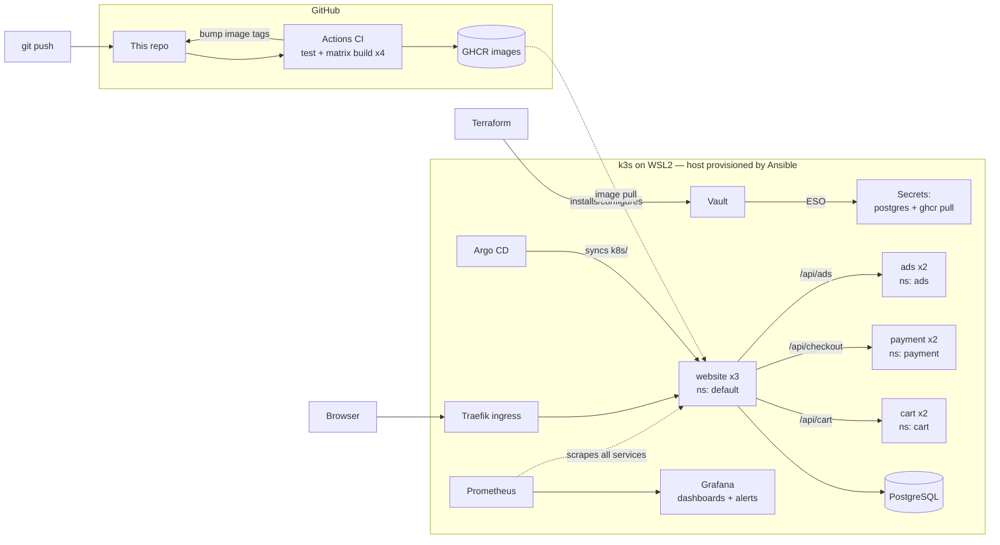

# prod_arch_web

**A production-style e-commerce platform built entirely as code — on a single Windows PC.**

A Nike-themed storefront (Node.js + PostgreSQL) with independent cart, payment, and ads microservices, load-balanced on k3s Kubernetes inside WSL2, observed with Prometheus + Grafana, and continuously delivered from this repo via GitHub Actions and Argo CD. The host is provisioned by **Ansible**, the secrets platform by **Terraform**, and secret values live only in **HashiCorp Vault**. After setup, a `git push` is the only deploy command that exists.

[](https://github.com/FKFT/prod_arch_web/actions/workflows/ci.yaml)


## Architecture



Every layer has one owner and one change method:

| Layer | Owner | You change it by |
|---|---|---|
| Host — k3s, WSL2 fixes, CLIs, port-forwards | **Ansible** (`ansible/`) | edit playbook → `ansible-playbook` (idempotent; rerun proves `changed=0`) |
| Secrets platform — Vault, External Secrets Operator | **Terraform** (`terraform/`) | edit `.tf` → `terraform plan` → `apply` (plan = drift detector) |
| Secret values | **Vault** (kv-v2) | `vault kv put` (ESO re-syncs to all namespaces within 1 min) |
| Apps — deployments, services, ingress, ExternalSecrets | **Argo CD** (GitOps over `k8s/`) | `git push` (selfHeal reverts manual edits in seconds) |

Argo CD and the monitoring stack were installed directly (`kubectl apply` / `helm install`); adopting them into Terraform is on the roadmap.

## Tech stack

| Concern | Choice |
|---|---|
| App / DB | Node.js 20 (Express, prom-client) / PostgreSQL 16 |
| Microservices | cart, payment (mock processor), ads — each in its own namespace, in-memory, independently failable |
| Containers | Docker (multi-stage, non-root, alpine) |
| Orchestration | k3s (CNCF-certified Kubernetes) on WSL2 Debian |
| Load balancing / ingress | Traefik + ServiceLB (bundled with k3s) |
| Monitoring | kube-prometheus-stack; per-service ServiceMonitors, "pods down" alert per service, e-commerce business-metrics dashboard |
| CI | GitHub Actions matrix → 4 images → GHCR (built-in `GITHUB_TOKEN`) |
| CD | Argo CD (pull-based GitOps: automated sync + prune + selfHeal) |
| IaC | Terraform (secrets platform) + Ansible (host) |
| Secrets | Vault (dev mode) + External Secrets Operator (kv-v2, Kubernetes auth, scoped read-only policy) |

## Repository layout

```
├── .github/workflows/  # CI: test → matrix build/push x4 → bump all image tags
├── ansible/            # host provisioning: k3s, WSL2 fixes, CLIs, systemd port-forward units
├── terraform/
│   ├── platform/       # Helm releases: Vault + External Secrets Operator
│   └── vault-config/   # Kubernetes auth backend, ESO policy + role
├── src/                # website: storefront, BFF proxy routes, metrics
├── services/           # cart/, payment/, ads/ — one Express microservice each
├── k8s/                # Argo CD-managed manifests: website, postgres, ingress,
│   ├── cart|payment|ads/   # per-namespace deployment/service/servicemonitor/externalsecret
│   └── ...             # ClusterSecretStore + ExternalSecrets (references only, no values)
├── init.sql            # products schema + seed data
└── docker-compose.yml  # local dev loop only
```

No secret value exists anywhere in this repo: secret *structure* (stores, ExternalSecrets, policies) is code; *values* live only in Vault. Terraform state is gitignored.

## How a deploy works

1. `git push` to `main`
2. CI runs each service's tests, builds 4 images tagged with the commit SHA, pushes to GHCR
3. CI writes the new tags into `k8s/kustomization.yaml` and commits back with `[skip ci]`
4. Argo CD notices the new commit and rolls the deployments — readiness-probe-gated, no manual step
5. Pods pull from the private registry using credentials ESO synced out of Vault

The website is a backend-for-frontend: if cart, payment, or ads is down, the storefront stays up and only that feature degrades — and the matching "pods down" Grafana alert fires.

## Getting started

```bash
# 0. Prereqs: WSL2 with systemd, Docker Desktop, Ansible
# 1. Host (k3s, WSL2 fixes, CLIs, port-forward units):
cd ansible && ansible-playbook -i inventory.ini site.yml --ask-become-pass
# 2. Secrets platform:
cd ../terraform/platform && terraform init && terraform apply
cd ../vault-config && terraform init && terraform apply   # over a vault port-forward
# 3. Seed secret values (the only values that exist anywhere):
kubectl exec -n vault vault-0 -- vault kv put secret/postgres POSTGRES_USER=... POSTGRES_PASSWORD=... POSTGRES_DB=...
kubectl exec -in vault vault-0 -- vault kv put secret/ghcr dockerconfigjson=-   # paste a registry credential
# 4. Argo CD + monitoring (not yet Terraform-managed):
#    install Argo CD and kube-prometheus-stack, add the repo credential and Application
# 5. Everything after: git push.
```

Then open `http://localhost:8000` (WSL2 only relays real sockets to Windows, so the site is exposed through a supervised `kubectl port-forward` unit rather than the ingress port directly — see `ansible/site.yml`).

## Highlights

- **Self-healing GitOps** — manual `kubectl` edits are reverted by Argo CD within seconds (measured); the repo is the only source of truth.
- **Independent failure domains** — each microservice lives in its own namespace with its own alerts; one going down degrades one feature, not the site.
- **Secrets done properly** — one source of truth in Vault; rotating the registry credential is a single `vault kv put`, propagated to all four namespaces within a minute.
- **Three drift detectors** — Ansible `changed=0`, `terraform plan`, and Argo CD sync status together prove the machine matches this repo.
- **Codified WSL2 quirks** — the two host-level failure modes that break k3s on WSL2 (a 9p mount that crashes kubelet's mount parser, and non-shared root mount propagation) are fixed idempotently in the playbook, not tribal knowledge.

## Roadmap

Adopt Argo CD + monitoring into Terraform · Vault with persistent storage + real unseal (currently dev mode) · Trivy image/IaC scanning as a CI gate · pod restarts on secret rotation (Reloader) · NetworkPolicies + Pod Security Standards · dynamic database credentials via Vault's database secrets engine.

---

*Built as a learning project that refuses to cut corners: every pattern here — GitOps, IaC layering, secrets management, observability — is the same one used in production platform engineering.*
